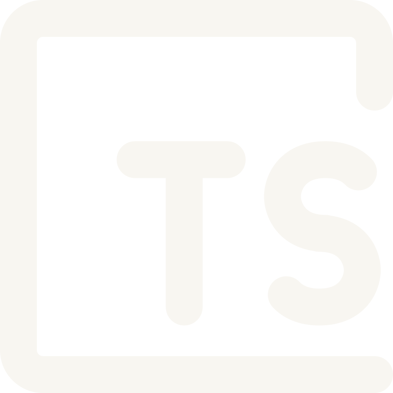
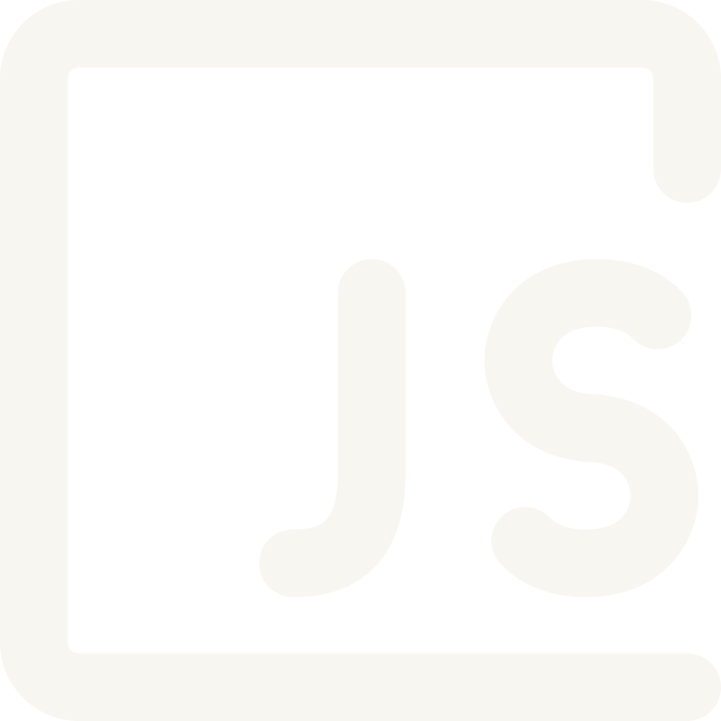
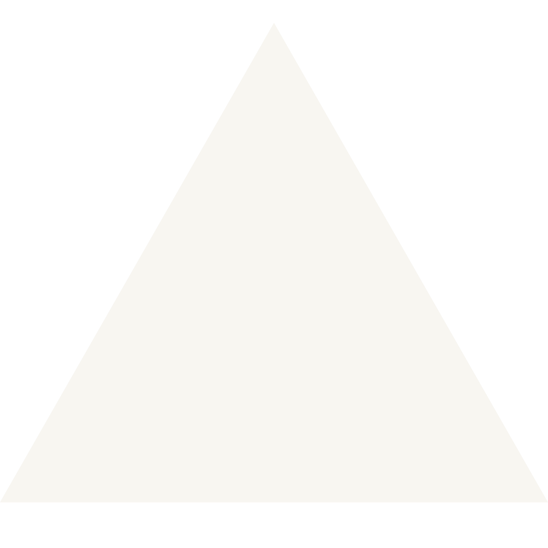

## Hello! 💫

I'm a dedicated **Frontend Developer** who recently graduated (April 2025) after two years at a vocational university.  
I enjoy building modern, responsive, and user-friendly web applications.  
I’m driven by clean, scalable code and love turning design ideas into interactive experiences.  
I take pride in refining my workflow and organizing my projects as I grow.

---

## 🏵️ What I’m Up To

- Continuing to expand my frontend skills while exploring new opportunities
- Diving into **backend development** and mastering **WCAG accessibility standards**
- Revisiting and iterating on past projects to deepen my understanding
- Building fresh web apps to put new concepts into practice
- Open to freelance assignments and collaborative, impact-driven projects

---

## 🖥️ Tech I've worked with

- **JavaScript / TypeScript**
- **HTML / CSS**
- **React / React Native**
- **Bootstrap / Styled Components**
- **Firebase / Firestore**
- **SQL / RestAPI**
- **PostgreSQL / CRUD**
- **socket.io / MongoDB**
- **Vercel / GitHub**
- ...and always curious to learn more!

---

## ☀️ Let's Connect

Feel free to connect or reach out:

  
  LinkedIn
  

  

  
  Email

## 🛠️ Tools & Technologies I Use

  
  
  
  
  
  
  
  

---

## ⚡ Fun Fact

I'm a frontend nerd who loves pixel-perfect layouts, dark themes, and naming things better on the third try 😅
